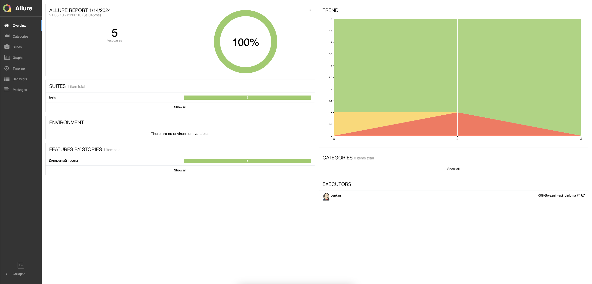
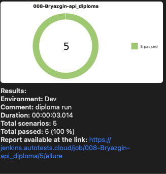

# Проект автоматизации тестирования API restful-booker.

## Краткое описание.
Проект содержит автотесты на api [restful-booker](https://restful-booker.herokuapp.com/apidoc/index.html#api-Booking-UpdateBooking). 

API тесты реализованы в связке `Python`+`Requests`.  
Запуск тестов осуществляется в `Jenkins`.  
Для отчетов по результатам прогона используется `Allure` + отправляется уведомление в телеграм с краткими результатами.

## Что покрыто тестами
- получение информации о бронировании по id
- healthcheck проверка
- создание бронирования
- удаление бронирования
- изменение существующего бронирования

## Технологии.
 

 

## Запуск на сервере.

Запуск тестов выполняется в проекте [Jenkins](https://jenkins.autotests.cloud/job/008-Bryazgin-api_diploma/).

### 1. Перейти в [проект](https://jenkins.autotests.cloud/job/008-Bryazgin-api_diploma/) и нажать кнопку `Build with Parameters`.

### 2. Указать параметры сборки и нажать кнопку `Build`
`COMMENT` - комментарий, указывающий особенности сборки  
`ENVIRONMENT` - выбор среды запуска тестов  

### 3. Дождаться окончания прогона
 

### 4. Для просмотра отчета нажать одну из иконок 
 

### Пример отчета в Allure

### Пример дэшборда в Allure testops

### По результатам прогона получаем уведомление с краткой информацией в телеграм

 
    

